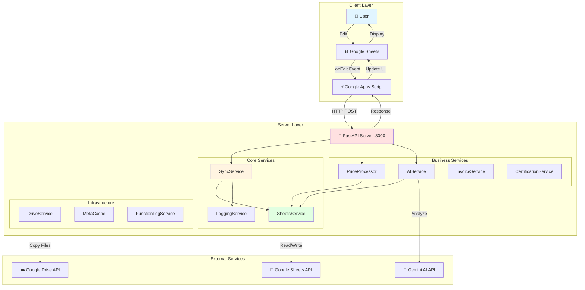
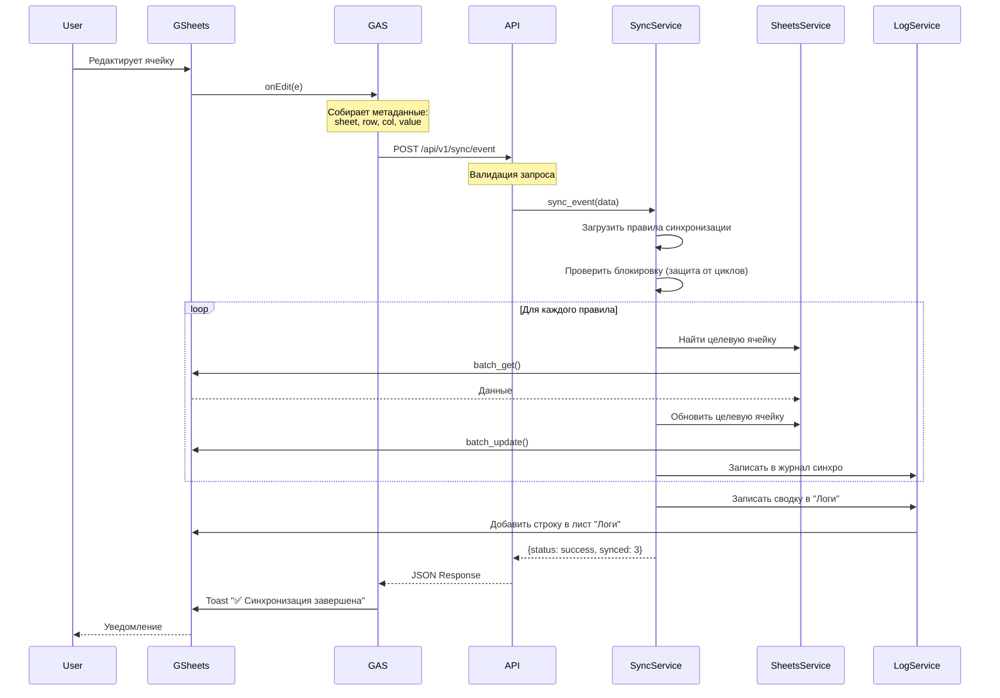

# AgentCare System Architecture

**Version:** 2.0  
**Last Updated:** 2026-01-07  
**Issue:** AgentCare-f8y

---

## Table of Contents

1. [System Overview](#system-overview)
2. [Architecture Diagram](#architecture-diagram)
3. [Components](#components)
4. [Data Flow](#data-flow)
5. [Services](#services)
6. [API Endpoints](#api-endpoints)
7. [Technology Stack](#technology-stack)

---

## System Overview

AgentCare - это гибридная система управления данными для Google Sheets, состоящая из:

- **Python Server (FastAPI)** - бэкенд для бизнес-логики
- **Google Apps Script (GAS)** - фронтенд клиент в Google Sheets
- **Google Drive API** - хранилище документов
- **Gemini AI** - интеллектуальный анализ данных

### Ключевые Принципы

1. **Server-First**: Вся бизнес-логика на Python сервере
2. **GAS as Thin Client**: GAS только собирает данные и отправляет на сервер
3. **Real-time Sync**: Автоматическая синхронизация при редактировании ячеек
4. **Audit Trail**: Детальное логирование всех операций

---

## Architecture Diagram

### High-Level Architecture



### Data Flow: Sync Operation



---

## Components

### 1. Python Server (src/)

**Структура:**
```
src/
├── main.py                 # Точка входа FastAPI
├── api/
│   ├── router.py          # Main API router
│   ├── endpoints.py       # Все API endpoints
│   └── webhooks.py        # Webhook handlers
├── services/              # Бизнес-логика
│   ├── sync.py           # Синхронизация
│   ├── sheets.py         # Google Sheets API
│   ├── logging.py        # Логирование
│   ├── drive.py          # Google Drive API
│   ├── ai.py             # AI анализ
│   ├── price_processor.py # Обработка прайсов
│   └── ...
├── models/               # Pydantic models
└── utils/                # Утилиты
```

**Ключевые файлы:**
- `main.py` - инициализация FastAPI, CORS, startup events
- `endpoints.py` - 3042 строки, все REST endpoints
- `sync.py` - 1375 строк, ядро системы синхронизации

### 2. Google Apps Script (gas/)

**Структура:**
```
gas/
├── 00_GlobalApiBridge.js  # Глобальные функции для API
├── 01Config.js            # Конфигурация меню
├── Client.gs              # HTTP клиент для сервера
├── Menu.gs                # Динамическое меню
├── 03Синхронизация.gs     # [LEGACY] Старая логика
├── 09LogArchive.gs        # Архивирование логов
└── ...
```

**Принцип работы:**
1. `onOpen()` - Simple Trigger, создаёт меню
2. `handleOnEdit()` - Installable Trigger, отправляет события на сервер
3. `Client.gs` - все функции `callServer*()` для общения с Python

---

## Services

### Core Services

#### SyncService (sync.py)
**Назначение:** Ядро системы синхронизации данных  
**Функции:** 41 метод  
**Строк:** 1375  
**Зависимости:** SheetsService, LoggingService, FunctionLogService

**Ключевые методы:**
- `sync_event()` - обработка onEdit события
- `sync_row()` - синхронизация одной строки
- `sync_full()` - полная синхронизация листа
- `list_rules()` - загрузка правил из YAML
- `save_rules()` - сохранение правил

**Правила синхронизации:**
```yaml
# config/rules/<spreadsheet_id>.yaml
rules:
  - id: rule-001
    enabled: true
    mode: unidirectional  # or bidirectional
    source_sheet: "Главная"
    source_header: "Наименование"
    target_sheet: "Информация"
    target_header: "Название продукта"
```

#### SheetsService (sheets.py)
**Назначение:** Обёртка над Google Sheets API  
**Функции:** Batch операции для производительности  
**Строк:** ~800

**Ключевые методы:**
- `batch_get()` - читать диапазоны
- `batch_update()` - писать диапазоны
- `get_all_values()` - весь лист
- `append_row()` - добавить строку
- `find_row_by_key()` - поиск по ключу

#### LoggingService (logging.py)
**Назначение:** Система логирования операций  
**Листы:**
- "Логи" - основной лог (сводные события)
- "Журнал синхро" - детальный журнал синхронизации
- "Журнал логов" - debug лог

**Ключевые методы:**
- `add_log()` - добавить запись в "Логи"
- `archive_logs()` - архивировать в отдельный spreadsheet
- `get_archive_status()` - статус архива
- `recreate_log_sheet()` - пересоздать лист логов

### Business Services

#### PriceProcessor (price_processor.py)
**Назначение:** Обработка прайс-листов от поставщиков  
**Строк:** ~1400  
**Поддерживаемые режимы:**
- `main` - основной прайс
- `tester` - тестеры
- `samples` - пробники
- `probes` - пробы

**Процесс:**
1. Читает данные из листа "Прайс"
2. [Матчинг продуктов] - сопоставление с базой
3. Обновляет цены в "Главная"
4. [Расчёт маржи] - автоматический расчёт

#### AIService (ai.py)
**Назначение:** Интеграция с Gemini AI для анализа  
**Функции:**
- Анализ INCI составов
- Определение назначения продукта
- Рекомендации по применению
- [Анализ PDF документов]

#### InvoiceService (invoice_service.py)
**Назначение:** Работа с накладными и документами  
**Функции:**
- `collect_and_copy_documents()` - собрать документы для инвойса
- Копирование ДС, Spirit документов в Drive

#### CertificationService (certification.py)
**Назначение:** Работа с сертификацией продуктов  
**Функции:**
- `structure_documents_353pp()` - структурирование документов для заявки
- Организация файлов в Google Drive по папкам

### Infrastructure Services

#### DriveService (drive.py)
**Назначение:** Работа с Google Drive API  
**Функции:**
- `create_folder()` - создать папку
- `copy_file()` - копировать файл
- Управление правами доступа

#### FunctionLogService (function_log_service.py)
**Назначение:** Детальное логирование шагов выполнения функций  
**Формат:** JSON Lines file storage  
**Retention:** Настраиваемый период хранения

---

## API Endpoints

### Sync Endpoints

```
POST   /api/v1/sync/row              # Синхронизация одной строки
POST   /api/v1/sync/range            # Синхронизация диапазона
POST   /api/v1/sync/full             # Полная синхронизация листа
POST   /api/v1/sync/event            # Обработка onEdit события
POST   /api/v1/sync/batch-event      # Пакетная обработка событий
POST   /api/v1/sync/add-article      # Добавить новый артикул
POST   /api/v1/sync/delete-articles  # Удалить артикулы
```

### Rules Management

```
GET    /api/v1/rules/{spreadsheet_id}           # Получить правила
POST   /api/v1/rules/{spreadsheet_id}/reload    # Перезагрузить правила
POST   /api/v1/rules/{spreadsheet_id}/create    # Создать правило
PATCH  /api/v1/rules/{spreadsheet_id}/{rule_id} # Обновить правило
DELETE /api/v1/rules/{spreadsheet_id}/{rule_id} # Удалить правило
```

### Logs Management

```
POST   /api/v1/logs/recreate       # Пересоздать лист логов
POST   /api/v1/logs/clean          # Очистить логи
POST   /api/v1/logs/recreate-debug # Пересоздать debug лог
POST   /api/v1/logs/archive        # Архивировать логи
GET    /api/v1/logs/archive/status # Статус архива
```

### Documents

```
POST   /api/v1/documents/collect           # Собрать документы для инвойса
POST   /api/v1/documents/structure-353pp   # Структурировать документы 353пп
```

### Price Processing

```
POST   /api/v1/price/process    # Обработать прайс-лист
GET    /api/v1/price/status     # Статус обработки
```

### AI Analysis

```
POST   /api/v1/ai/analyze        # Анализ продукта
POST   /api/v1/ai/analyze-batch  # Пакетный анализ
POST   /api/v1/ai/analyze-pdf    # Анализ PDF документа
GET    /api/v1/ai/status         # Проверка статуса AI сервиса
```

### Utility

```
GET    /health                   # Health check
GET    /api/v1/status           # Подробный статус системы
POST   /api/v1/sort             # Сортировка данных
```

**Всего endpoints:** ~40+

---

## Technology Stack

### Backend (Python)

| Технология | Версия | Назначение |
|-----------|--------|------------|
| **FastAPI** | Latest | Web framework |
| **gspread** | Latest | Google Sheets API |
| **google-auth** | Latest | Аутентификация |
| **Pydantic** | v2 | Валидация данных |
| **structlog** | Latest | Логирование |
| **Poetry** | Latest | Менеджер зависимостей |

### Frontend (GAS)

| Технология | Назначение |
|-----------|------------|
| **Google Apps Script** | Клиентская логика |
| **HtmlService** | UI модальные окна |
| **UrlFetchApp** | HTTP клиент |

### External APIs

| Сервис | Использование |
|--------|---------------|
| **Google Sheets API** | Чтение/запись данных |
| **Google Drive API** | Управление файлами |
| **Gemini AI API** | Анализ текстов и PDF |

### Infrastructure

| Компонент | Детали |
|-----------|--------|
| **Server** | VPS Ubuntu 22.04, IP: 46.226.167.153 |
| **Port** | 8000 (HTTP) |
| **Process Manager** | systemd (agentcare.service) |
| **Logs** | `/var/log/agentcare/` |

---

## Security & Auth

### Service Account
- **File:** `credentials/agentcare-service-account.json`
- **Permissions:** 
  - Google Sheets API
  - Google Drive API
  - Full access to managed spreadsheets

### CORS
```python
# Разрешены запросы от:
origins = [
    "https://script.google.com",
    "https://docs.google.com",
]
```

---

## Future Development

### [Planned Features]

1. **[Redis Cache]** - кэширование данных для производительности
2. **[WebSocket Support]** - real-time уведомления
3. **[Background Jobs]** - Celery для тяжёлых задач
4. **[Testing Suite]** - pytest покрытие >80%
5. **[Monitoring]** - Prometheus + Grafana
6. **[API Versioning]** - v2 API с улучшенными моделями

### Technical Debt

- ⚠️ Объединить `logging.py` + `logging_service.py`
- ⚠️ Объединить `certification.py` + `certification_service.py`  
- ⚠️ Разделить `endpoints.py` (3042 строки!) на модули
- ⚠️ Добавить unit тесты для всех сервисов
- ⚠️ Миграция оставшихся GAS функций на сервер

---

## References

- [API Reference](./API_REFERENCE.md)
- [Function Map](./FUNCTION_MAP.md)
- [AI Rules](../AI_RULES.md)
- [Deployment Guide](../PROD_DEPLOY.md)
