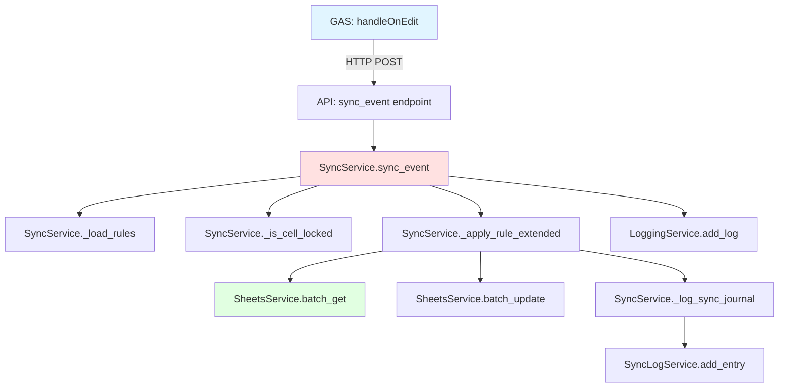
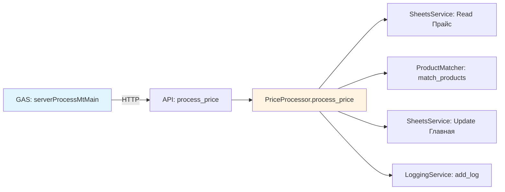

# Function Map - AgentCare System

**Issue:** AgentCare-f8y  
**Last Updated:** 2026-01-07  
**Total Functions:**  
- Python: ~200+ methods
- GAS: ~180+ functions  
- API Endpoints: 40+

---

## Table of Contents

1. [Status Legend](#status-legend)
2. [Python Services](#python-services)
3. [GAS Functions](#gas-functions)
4. [API Endpoints](#api-endpoints)
5. [Function Dependencies](#function-dependencies)
6. [Migration Status](#migration-status)

---

## Status Legend

| Symbol | Status | Description |
|--------|--------|-------------|
| ✅ | Working | Функция работает и протестирована |
| 🚧 | [In Development] | Функция в процессе разработки |
| ⚠️ | Deprecated | Помечена для удаления/замены |
| ❌ | To Delete | Неиспользуется, удалить |
| 🔄 | Migrating | Мигрирует с GAS на Server |

---

## Python Services

### SyncService (src/services/sync.py)

**Core Sync Functions:**

| Function | Status | Description | Dependencies |
|----------|--------|-------------|--------------|
| `sync_event()` | ✅ | Обработка onEdit события | SheetsService, LoggingService |
| `sync_row()` | ✅ | Синхронизация одной строки | SheetsService |
| `sync_full()` | ✅ | Полная синхронизация листа | SheetsService, LoggingService |
| `_apply_rule()` | ✅ | Применение одного правила | SheetsService |
| `_apply_rule_extended()` | ✅ | Применение с bidirectional | SheetsService |
| `_get_matching_rules()` | ✅ | Поиск подходящих правил | - |
| `_is_cell_locked()` | ✅ | Проверка блокировки (anti-loop) | - |
| `_lock_cell()` | ✅ | Блокировка ячейки | - |

**Rules Management:**

| Function | Status | Description |
|----------|--------|-------------|
| `list_rules()` | ✅ | Получить все правила |
| `save_rules()` | ✅ | Сохранить правила в YAML |
| `create_rule()` | ✅ | Создать новое правило |
| `update_rule()` | ✅ | Обновить существующее правило |
| `delete_rule()` | ✅ | Удалить правило |
| `toggle_rule()` | ✅ | Вкл/выкл правило |
| `_load_rules()` | ✅ | Загрузить из YAML |
| `_save_rules_yaml()` | ✅ | Сохранить в YAML |

**Article Management:**

| Function | Status | Description |
|----------|--------|-------------|
| `add_article()` | ✅ | Добавить новый артикул |
| `delete_articles()` | ✅ | Удалить артикулы |
| `_get_next_id()` | ✅ | Генерация следующего ID |
| `_get_project_prefix()` | ✅ | Получить префикс проекта |

---

### SheetsService (src/services/sheets.py)

| Function | Status | Description |
|----------|--------|-------------|
| `get_all_values()` | ✅ | Получить весь лист |
| `batch_get()` | ✅ | Пакетное чтение |
| `batch_update()` | ✅ | Пакетная запись |
| `append_row()` | ✅ | Добавить строку |
| `find_row_by_key()` | ✅ | Найти строку по ключу |
| `get_headers()` | ✅ | Получить заголовки |
| `clear_sheet()` | ✅ | Очистить лист |

---

### LoggingService (src/services/logging.py)

**Main Logging:**

| Function | Status | Description |
|----------|--------|-------------|
| `add_log()` | ✅ | Добавить запись в "Логи" |
| `recreate_log_sheet()` | ✅ | Пересоздать лист логов |
| `archive_logs()` | ✅ | Архивировать логи |
| `get_archive_status()` | ✅ | Статус архива |
| `_find_or_create_archive()` | ✅ | Найти/создать архивный файл |
| `_get_archive_name()` | ✅ | Имя архива |

**Duplicates Found:** ⚠️
- `logging.py` (16KB)
- `logging_service.py` (14KB)

**Action Required:** Объединить в один файл `logging.py`

---

### PriceProcessor (src/services/price_processor.py)

**Main Functions:**

| Function | Status | Description |
|----------|--------|-------------|
| `process_price()` | ✅ | Обработка прайс-листа |
| `_match_products()` | 🚧 | [Матчинг продуктов] |
| `_update_prices()` | ✅ | Обновление цен |
| `_calculate_margin()` | 🚧 | [Расчёт маржи] |

---

### AIService (src/services/ai.py)

| Function | Status | Description |
|----------|--------|-------------|
| `analyze_product()` | ✅ | Анализ продукта |
| `analyze_batch()` | ✅ | Пакетный анализ |
| `analyze_pdf()` | 🚧 | [Анализ PDF] |
| `check_service()` | ✅ | Проверка доступности |

---

### DriveService (src/services/drive.py)

| Function | Status | Description |
|----------|--------|-------------|
| `create_folder()` | ✅ | Создать папку |
| `copy_file()` | ✅ | Копировать файл |
| `get_file_metadata()` | 🚧 | [Получить метаданные] |
| `share_file()` | 🚧 | [Расшарить файл] |

---

### CertificationService

**Duplicates Found:** ⚠️
- `certification.py` (4KB)
- `certification_service.py` (17KB)

**Functions:**

| Function | Status | File | Description |
|----------|--------|------|-------------|
| `structure_documents_353pp()` | ✅ | Both | Структурирование документов |
| `generate_protocols()` | ✅ | certification_service.py | Генерация протоколов |
| `generate_ds_layouts()` | ✅ | certification_service.py | Генерация макетов ДС |

**Action Required:** Объединить в один `certification.py`

---

## GAS Functions

### Global API Bridge (00_GlobalApiBridge.js)

**Trigger Handlers:**

| Function | Status | Description |
|----------|--------|-------------|
| `onOpen()` | ✅ | Simple trigger - создание меню |
| `handleOnOpen()` | ✅ | Installable - полная инициализация |
| `onEdit()` | ⚠️ | Deprecated - используем handleOnEdit |
| `handleOnEdit()` | ✅ | Installable - синхронизация |
| `handleOnChange()` | ✅ | Обработка структурных изменений |

**Sync Functions:**

| Function | Status | Migration | Description |
|----------|--------|-----------|-------------|
| `addArticleManually()` | ✅ | 🔄 → Server | Добавить артикул |
| `deleteSelectedRowsWithSync()` | ✅ | 🔄 → Server | Удалить строки |
| `syncSelectedRow()` | ✅ | 🔄 → Server | Синхронизация строки |
| `runFullSync()` | ✅ | 🔄 → Server | Полная синхронизация |

**Log Functions:**

| Function | Status | Migration | Description |
|----------|--------|-----------|-------------|
| `recreateLogSheet()` | ✅ | ✅ Migrated | Пересоздать лог |
| `quickCleanLogSheet()` | ✅ | ✅ Migrated | Очистить лог |
| `recreateDebugLogSheet()` | ✅ | ✅ Migrated | Debug лог |

**Document Functions:**

| Function | Status | Migration | Description |
|----------|--------|-----------|-------------|
| `collectAndCopyDocuments()` | ✅ | ✅ Migrated | Собрать документы |
| `structureDocuments_353pp()` | ✅ | ✅ Migrated | Структурировать 353пп |

---

### Client (Client.gs)

**Server Communication:**

| Function | Status | Description |
|----------|--------|-------------|
| `callServerLogCommand()` | ✅ | Команды логов |
| `callServerCollectDocuments()` | ✅ | Сбор документов |
| `callServerArchiveLogs()` | ✅ | Архивирование |
| `callServerShowArchiveStatus()` | ✅ | Статус архива |
| `callServerStructureDocuments353pp()` | ✅ | Структурирование 353пп |
| `callServerProcessPrice()` | ✅ | Обработка прайса |
| `callServerStructureSort()` | ✅ | Сортировка |
| `callServerSmartMatch()` | ✅ | Smart матчинг |

---

### Legacy Sync (03Синхронизация.js)

**Status:** ⚠️ **DEPRECATED** - Мигрируется на сервер

| Function | Status | Description |
|----------|--------|-------------|
| `onEditHandler()` | ⚠️ | Старая логика onEdit |
| `syncBidirectional()` | ⚠️ | Двунаправленная синхронизация |
| `applyRules()` | ⚠️ | Применение правил |

**Action:** Удалить после полной миграции на сервер

---

### Price Processing (02AutoPrice.js, 12MTPriceManager.js, 12SKPriceManager.js)

**Status:** 🔄 Частично мигрировано

| Function | File | Status | Migration |
|----------|------|--------|-----------|
| `processMtMainPrice()` | 02AutoPrice.js | ✅ | 🔄 → Server |
| `processMtTesterPrice()` | 02AutoPrice.js | ✅ | 🔄 → Server |
| `processSkPriceSheet()` | 02AutoPrice.js | ✅ | 🔄 → Server |
| `updatePriceCalculationFormulas()` | 12MTPriceManager.js | ✅ | Local |
| `recalculatePriceDynamicsFormulas()` | 12MTPriceManager.js | ✅ | Local |

---

## API Endpoints

### Sync Endpoints

```
✅ POST   /api/v1/sync/row
✅ POST   /api/v1/sync/full  
✅ POST   /api/v1/sync/event
✅ POST   /api/v1/sync/batch-event
✅ POST   /api/v1/sync/add-article
✅ POST   /api/v1/sync/delete-articles
```

### Rules Management

```
✅ GET    /api/v1/rules/{spreadsheet_id}
✅ POST   /api/v1/rules/{spreadsheet_id}/reload
✅ POST   /api/v1/rules/{spreadsheet_id}/create
✅ PATCH  /api/v1/rules/{spreadsheet_id}/{rule_id}
✅ DELETE /api/v1/rules/{spreadsheet_id}/{rule_id}
✅ PATCH  /api/v1/rules/{spreadsheet_id}/{rule_id}/toggle
```

### Logs

```
✅ POST   /api/v1/logs/recreate
✅ POST   /api/v1/logs/clean
✅ POST   /api/v1/logs/recreate-debug
✅ POST   /api/v1/logs/archive
✅ GET    /api/v1/logs/archive/status
```

### Documents

```
✅ POST   /api/v1/documents/collect
✅ POST   /api/v1/documents/structure-353pp
```

### Price

```
✅ POST   /api/v1/price/process
🚧 GET    /api/v1/price/status  [In Development]
```

### AI

```
✅ POST   /api/v1/ai/analyze
✅ POST   /api/v1/ai/analyze-batch
🚧 POST   /api/v1/ai/analyze-pdf  [In Development]
✅ GET    /api/v1/ai/status
```

---

## Function Dependencies

### Sync Flow Dependency Tree



### Price Processing Flow



---

## Migration Status

### ✅ Fully Migrated to Server

- Log management (recreate, clean, archive)
- Document collection
- 353pp structuring
- Sync rules management

### 🔄 Partially Migrated

- Price processing (основная логика на сервере)
- Sorting (на сервере, но формулы в GAS)

### 📋 Pending Migration

- [ ] Formula recalculation (`updatePriceCalculationFormulas`)
- [ ] Invoice creation (`createFullInvoice`)
- [ ] Export functions (`exportPromotions`, `exportSets`)
- [ ] Spirit protocols (`generateSpiritProtocols`)

### ⚠️ To Keep in GAS (UI/UX)

- Menu creation
- Toast notifications
- Modal dialogs
- Sheet formatting/coloring

---

## Cleanup Candidates

### ❌ Functions to Delete

**Python:**
- None identified (all used)

**GAS:**
1. **03Синхронизация.js** - старая логика синхронизации (172KB!)
   - `onEditHandler()` - заменено на `handleOnEdit` + Server
   - `syncBidirectional()` - теперь в SyncService
   - `applyRules()` - теперь в SyncService

**Action:** Можно удалить после финального тестирования

---

## Technical Debt Summary

### High Priority

1. ⚠️ **Объединить дубликаты:**
   - `logging.py` + `logging_service.py` → один файл
   - `certification.py` + `certification_service.py` → один файл

2. ⚠️ **Разделить endpoints.py:**
   - 3056 строк, 171 функция!
   - Разделить на модули: `sync_endpoints.py`, `logs_endpoints.py`, etc.

3. ⚠️ **Удалить 03Синхронизация.js:**
   - 172KB устаревшей логики
   - Полностью заменена сервером

### Medium Priority

4. 🚧 **Завершить миграцию:**
   - Formula services
   - Invoice generation
   - Export services

5. 🚧 **Добавить тесты:**
   - Unit tests для всех сервисов
   - Integration tests для endpoints

---

## References

- [Architecture Documentation](./ARCHITECTURE.md)
- [API Reference](./API_REFERENCE.md)
- [Migration Guide](./docs/MIGRATION_STATUS.md)
